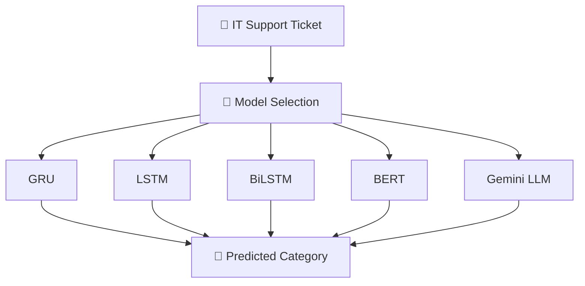

# 🎫 Intelligent IT Helpdesk Ticket Routing System Using Deep Learning


An end-to-end **Natural Language Processing, Deep Learning, Transformer, and Generative AI application** for automatically classifying IT helpdesk tickets into the appropriate support category.

This project compares multiple approaches:

- GRU
- LSTM
- BiLSTM
- BERT
- Gemini LLM

The application is deployed using **Streamlit**, allowing users to select different models and classify IT support tickets.

---

## 📑 Table of Contents

- [🚀 Live Demo](#-live-demo)
- [📌 Project Objective](#-project-objective)
- [🏗️ Project Workflow](#-project-workflow)
- [🤖 Models Implemented](#-models-implemented)
- [🗂️ Ticket Categories](#-ticket-categories)
- [🧹 Text Preprocessing](#-text-preprocessing)
- [💻 Streamlit Application](#-streamlit-application)
- [📁 Project Structure](#-project-structure)
- [🛠️ Technologies Used](#-technologies-used)
- [⚙️ Installation](#-installation)
- [🔐 Gemini API Configuration](#-gemini-api-configuration)
- [▶️ Run the Application](#-run-the-application)
- [☁️ Streamlit Deployment](#-streamlit-deployment)
- [🧪 Example Ticket](#-example-ticket)
- [📊 Model Output](#-model-output)
- [🌟 Key Features](#-key-features)
- [🔮 Future Improvements](#-future-improvements)
- [🤝 Contributing](#-contributing)
- [📄 License](#-license)
- [📚 Learning Outcomes](#-learning-outcomes)
- [👨‍💻 Author](#-author)
- [⭐ Support](#-support)

---

## 🚀 Live Demo

🔗 **Streamlit Application:**  
[Open Live Application](https://intelligent-it-appdesk-ticket-routing-system-using-deep-learni.streamlit.app/)

🔗 **GitHub Repository:**  
[View GitHub Repository](https://github.com/narayanareddy7129/Intelligent-IT-Helpdesk-Ticket-Routing-System-using-Deep-Learning)

---

## 📌 Project Objective

The main objective of this project is to automatically classify an IT support ticket into the appropriate category.

Manual ticket routing can be time-consuming and may delay issue resolution. This system uses Deep Learning, Transformer models, and Generative AI to predict the appropriate category based on the ticket description.

---

## 🏗️ Project Workflow



---

## 🤖 Models Implemented

The project implements five different models for IT helpdesk ticket classification.

### 1. GRU

**Gated Recurrent Unit (GRU)** is used to process sequential ticket text efficiently.

```text
Text
 ↓
Preprocessing
 ↓
Tokenizer
 ↓
Embedding
 ↓
GRU
 ↓
Dense Layer
 ↓
Softmax
```

---

### 2. LSTM

**Long Short-Term Memory (LSTM)** is used to learn long-term dependencies within ticket text.

```text
Text
 ↓
Preprocessing
 ↓
Tokenizer
 ↓
Embedding
 ↓
LSTM
 ↓
Dense Layer
 ↓
Softmax
```

---

### 3. BiLSTM

**Bidirectional LSTM (BiLSTM)** processes ticket text in both forward and backward directions.

```text
Text
 ↓
Preprocessing
 ↓
Tokenizer
 ↓
Embedding
 ↓
Bidirectional LSTM
 ↓
Dense Layer
 ↓
Softmax
```

---

### 4. BERT

The project uses a fine-tuned **BERT (`bert-base-uncased`)** model for Transformer-based ticket classification.

```text
Text
 ↓
WordPiece Tokenizer
 ↓
BERT Encoder
 ↓
[CLS] Representation
 ↓
Classification Layer
 ↓
Softmax
```

#### BERT Configuration

- Base Model: `bert-base-uncased`
- Framework: Hugging Face Transformers
- Backend: PyTorch
- Hidden Size: 768
- Transformer Layers: 12
- Attention Heads: 12
- Maximum Sequence Length: 128

---

### 5. Gemini LLM

The project also integrates **Gemini LLM** through the Google Generative AI API.

Unlike the supervised Deep Learning models, Gemini performs **prompt-based ticket classification**.

```text
IT Support Ticket
        ↓
Classification Prompt
        ↓
Gemini LLM
        ↓
Predicted Category
```

The original ticket text is provided to Gemini along with the available ticket categories, and the model is instructed to return exactly one valid category.

---

## 🗂️ Ticket Categories

The system classifies tickets into the following categories:

- Access
- Administrative Rights
- Hardware
- HR Support
- Internal Project
- Miscellaneous
- Purchase
- Storage

---

## 🧹 Text Preprocessing

The GRU, LSTM, and BiLSTM models use the following preprocessing pipeline:

- Convert text to lowercase
- Expand contractions
- Remove special characters
- Tokenize the text
- Convert tokens into numerical sequences
- Apply sequence padding

### BERT Preprocessing

BERT uses its own **WordPiece tokenizer** and applies:

- Tokenization
- Truncation
- Padding
- Attention masks

### Gemini LLM

Gemini receives the original ticket text through a classification prompt.

---

## 💻 Streamlit Application

The Streamlit application allows users to:

- Enter an IT support ticket
- Select one of five models
- Predict the ticket category
- View model confidence for GRU, LSTM, BiLSTM, and BERT
- View Top-3 predictions
- View prediction probabilities
- View processed text
- Use Gemini LLM for Generative AI-based classification

### Available Models

```text
1. GRU
2. LSTM
3. BiLSTM
4. BERT
5. Gemini LLM
```

---

## 📁 Project Structure

```text
Intelligent-IT-Helpdesk-Ticket-Routing-System-using-Deep-Learning/
│
├── app.py
├── utils.py
├── gemini_model.py
├── requirements.txt
├── .gitignore
├── .gitattributes
│
├── tokenizer.pkl
├── label_encoder.pkl
│
├── models/
│   ├── gru_model.keras
│   ├── lstm_model.keras
│   └── bilstm_model.keras
│
├── bert_ticket_classifier/
│   ├── config.json
│   ├── model.safetensors
│   ├── special_tokens_map.json
│   ├── tokenizer.json
│   ├── tokenizer_config.json
│   ├── training_args.bin
│   └── vocab.txt
│
├── notebooks/
│   └── BERT.ipynb
│
└── streamlit/
    └── config.toml
```

> Large model files are managed using **Git LFS**.

---

## 🛠️ Technologies Used

### Programming

- Python

### Data Processing

- NumPy
- Pandas

### Machine Learning

- Scikit-learn

### Deep Learning

- TensorFlow
- Keras
- PyTorch

### Natural Language Processing

- NLTK
- Hugging Face Transformers

### Generative AI

- Google Gemini API
- Google GenAI SDK

### Deployment

- Streamlit

### Version Control

- Git
- GitHub
- Git LFS

---

## ⚙️ Installation

### 1. Clone the Repository

```bash
git clone https://github.com/narayanareddy7129/Intelligent-IT-Helpdesk-Ticket-Routing-System-using-Deep-Learning.git
```

Move into the project directory:

```bash
cd Intelligent-IT-Helpdesk-Ticket-Routing-System-using-Deep-Learning
```

### 2. Install Git LFS

Because this project contains large trained model files, install Git LFS:

```bash
git lfs install
```

If the model files are not downloaded automatically:

```bash
git lfs pull
```

### 3. Create a Virtual Environment

```bash
python -m venv env
```

#### Windows

```bash
env\Scripts\activate
```

#### Linux / macOS

```bash
source env/bin/activate
```

### 4. Install Dependencies

```bash
pip install -r requirements.txt
```

---

## 🔐 Gemini API Configuration

To use the Gemini LLM model locally, create a `.env` file in the project root:

```text
GEMINI_API_KEY=your_api_key_here
```

⚠️ **Never upload your API key or `.env` file to GitHub.**

Your `.gitignore` should contain:

```text
.env
env/
.venv/
__pycache__/
.ipynb_checkpoints/
```

---

## ▶️ Run the Application

Run:

```bash
streamlit run app.py
```

The application will open in your browser.

---

## ☁️ Streamlit Deployment

For Streamlit Cloud deployment, store the Gemini API key in **Streamlit Secrets**:

```toml
GEMINI_API_KEY = "your_api_key_here"
```

The application supports:

- `.env` for local development
- `st.secrets` for Streamlit Cloud deployment

---

## 🧪 Example Ticket

### Input

```text
I forgot my password and cannot log in to my company account.
I tried resetting my password, but I still cannot access the
internal portal. Please check whether my account is active and
whether I have the required permissions.
```

### Predicted Category

```text
Access
```

---

## 📊 Model Output

### GRU, LSTM, BiLSTM, and BERT

The application displays:

- Predicted category
- Model confidence
- Top-3 predictions
- Prediction probability chart

### Gemini LLM

The application displays:

- Predicted category
- Original ticket sent to the model

> Gemini is a Generative AI model, so it does not use the same probability output mechanism as the supervised classification models.

---

## 🌟 Key Features

- Multi-model ticket classification
- GRU implementation
- LSTM implementation
- BiLSTM implementation
- Transformer-based BERT classification
- Gemini LLM integration
- Interactive model selection
- Confidence visualization
- Top-3 predictions
- Probability charts
- Text preprocessing pipeline
- Streamlit deployment
- Secure API key management
- Git LFS support for large models

---

## 🔮 Future Improvements

- Add more ticket categories
- Compare all models using Accuracy, Precision, Recall, and F1-score
- Add confusion matrices
- Add batch ticket prediction
- Add ticket priority prediction
- Add ticket summarization using LLMs
- Implement automatic model selection
- Store prediction history
- Add user authentication
- Integrate with a real helpdesk system
- Add RAG-based IT knowledge-base assistance

---

## 🤝 Contributing

Contributions are welcome. If you'd like to improve this project:

1. Fork the repository
2. Create a new branch (`git checkout -b feature/your-feature-name`)
3. Commit your changes (`git commit -m "Add your feature"`)
4. Push to your branch (`git push origin feature/your-feature-name`)
5. Open a Pull Request

For major changes, please open an issue first to discuss what you'd like to change.

---

## 📚 Learning Outcomes

Through this project, I gained hands-on experience with:

- Natural Language Processing
- Text preprocessing
- Tokenization
- Sequence padding
- Word embeddings
- GRU
- LSTM
- BiLSTM
- Transformers
- BERT
- Hugging Face
- TensorFlow
- Keras
- PyTorch
- Generative AI
- Gemini API
- Prompt engineering
- Streamlit deployment
- Git
- GitHub
- Git Large File Storage (Git LFS)
- API key security

---

## 👨‍💻 Author

**Narayana Reddy**

GitHub:  
https://github.com/narayanareddy7129

